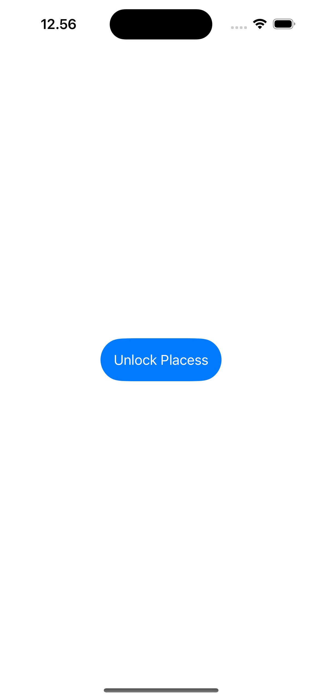
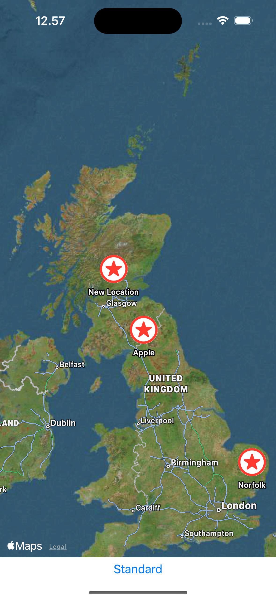
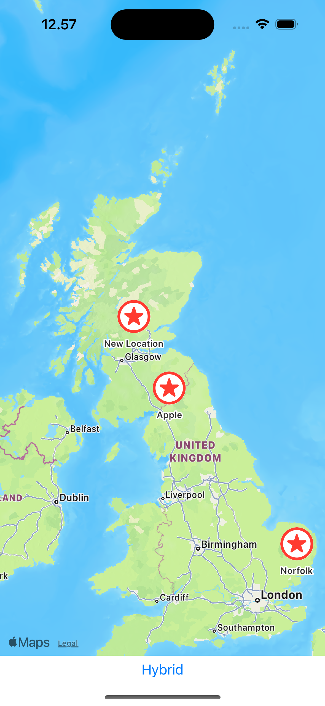
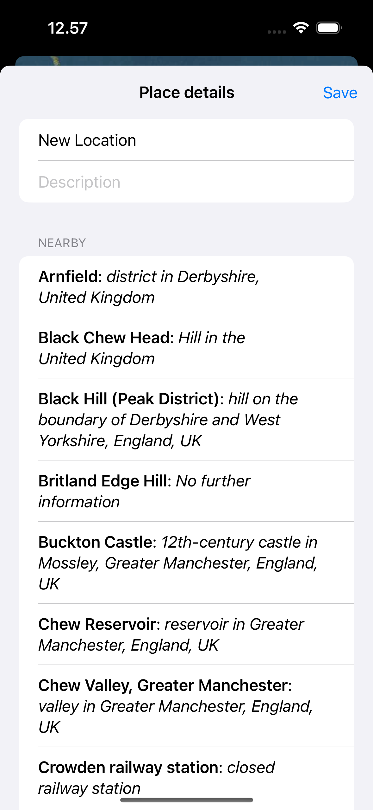

# BucketList
This is a basic learning project to create an app that helps users build a private list of places they intend to visit. The app allows users to mark locations on a map, add descriptions for those places, and explore nearby points of interest. All data is securely saved to iOS storage, with access protected by Face ID authentication.

---
The source learning is from the 14th project of course "100 Days of SwiftUI" (https://www.hackingwithswift.com/100/swiftui)

---
## Goals
1. Prompt users to unlock the app using Face ID for added security.
2. Display a main page with a map where users can mark locations.
3. Allow users to add descriptions to the marked locations for better organization.
4. Enable switching between standard and hybrid map views for a flexible navigation experience.
5. Include functionality to search and display interesting places near the marked locations.
6. Save all data persistently to iOS storage for future reference.

# BucketList – Image Comments Feature

---
